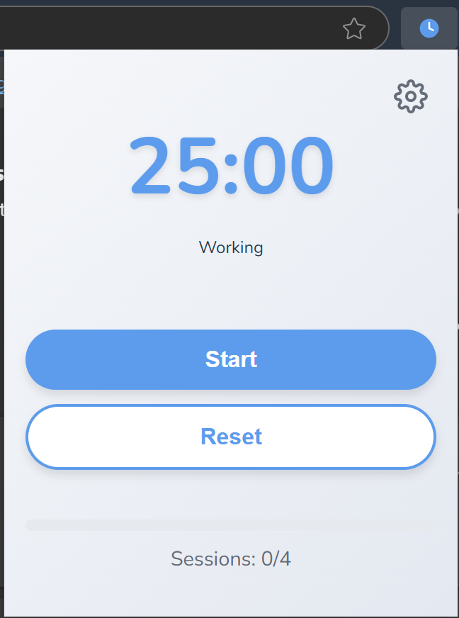
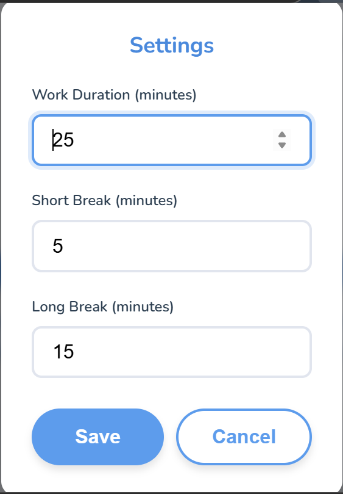
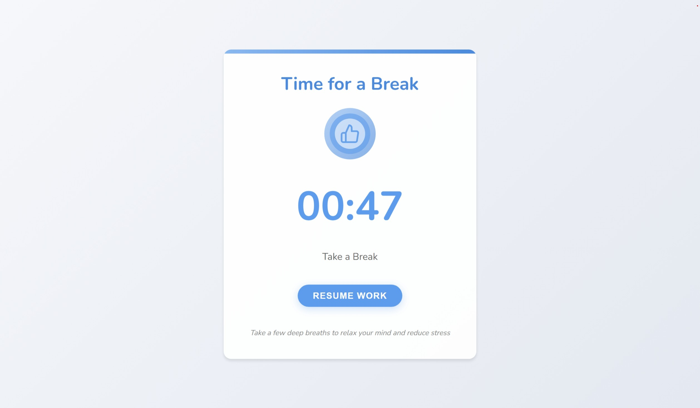

# 🍅 Serene Focus - Pomodoro Timer 🚀

This Chromium extension helps you stay productive using the Pomodoro Technique — work in focused sprints, take regular breaks, and maintain your flow state. Perfect for developers, students, and professionals looking to maximize their efficiency. 🎯

## ✨ Features

- ⏱️ **Smart Timer** - 25/5 work/break intervals by default
- 🔄 **Auto Session Tracking** - 4 sessions = long break
- 🚫 **Break Enforcement** - Full-screen break window blocks all other tabs
- 🔄 **Tab Restoration** - All tabs are automatically restored after breaks
- 🎨 **Minimal UI** - Clean, distraction-free interface
- 🎵 **Sound Alerts** - Gentle notifications for session changes
- 🛠️ **Fully Customizable** - Adjust all timers to your needs

## 🧰 Tech Stack

- 🌐 **Frontend**: HTML5, CSS3, JavaScript (ES6+)
- 🏗️ **Browser API**: Chromium Extension Manifest V3
- 🏪 **Storage**: Chromium Storage API
- 🎨 **Styling**: Pure CSS (No external dependencies)
- 🔔 **Notifications**: Web Notifications API

## 🚀 Quick Start

1. Install from Chromium Web Store (Coming Soon) or load manually:
   ```bash
   git clone [your-repo-url]
   ```
2. Open `Chromium://extensions/`
3. Enable "Developer mode" (top-right)
4. Click "Load unpacked" and select the extension folder

## 📸 Screenshots

<div style="display: flex; flex-wrap: wrap; gap: 15px; justify-content: center;">
  <div style="flex: 1; min-width: 200px; max-width: 300px;">
    
    <p style="text-align: center; font-size: 0.9em; color: #666;">Main Interface</p>
  </div>
  <div style="flex: 1; min-width: 200px; max-width: 300px;">
    
    <p style="text-align: center; font-size: 0.9em; color: #666;">Settings Interface</p>
  </div>
  <div style="flex: 1; min-width: 200px; max-width: 300px;">
    
    <p style="text-align: center; font-size: 0.9em; color: #666;">Session History</p>
  </div>
</div>

## 🎮 How to use

1. Click the extension icon to open the timer
2. Start working - the timer runs in the background
3. When break time comes, all tabs are automatically saved and hidden
4. A full-screen break window appears, blocking access to other tabs
5. After the break ends, all your tabs are magically restored
6. When time's up, take a break!
7. After 4 sessions, enjoy a longer break
8. Rinse and repeat for maximum productivity

## 🎥 Video Tutorial

<div align="center" style="width: 50%; margin: 0 auto;">
  <a href="https://www.youtube.com/watch?v=m4TTqfAWLck">
    
  </a>
  <p><em>Click the image above to watch the full demo video</em></p>
</div>

## 🌐 Connect With Me

Check out more of my work and connect with me online:  
👉 [https://linktr.ee/theankushrai](https://linktr.ee/theankushrai)

### Includes:

- GitHub
- LeetCode
- GeeksForGeeks
- LinkedIn
